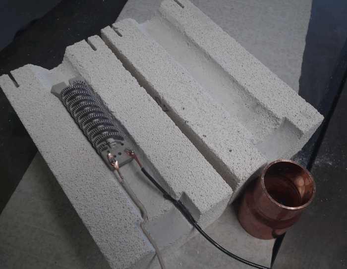
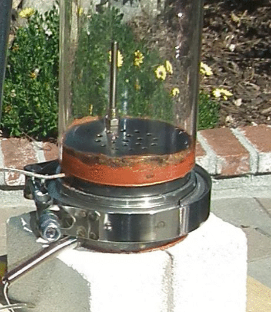
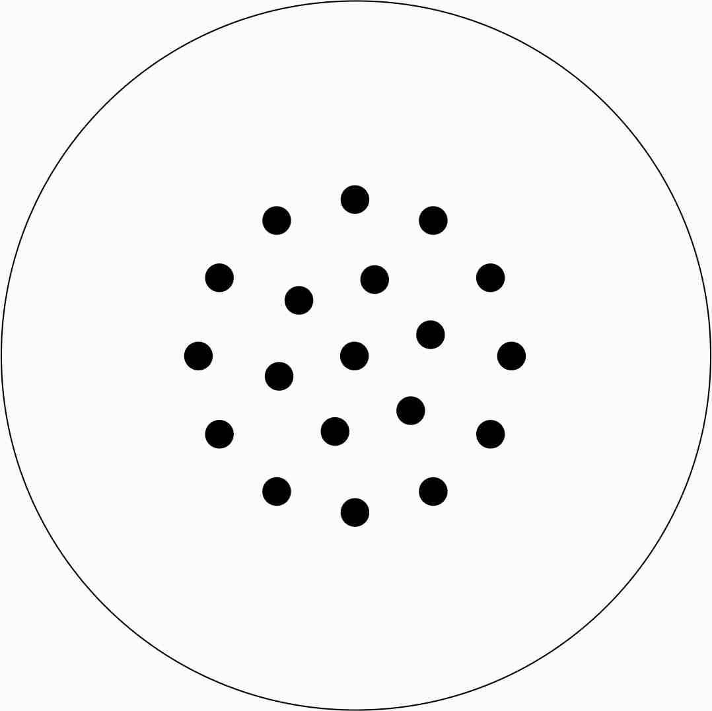
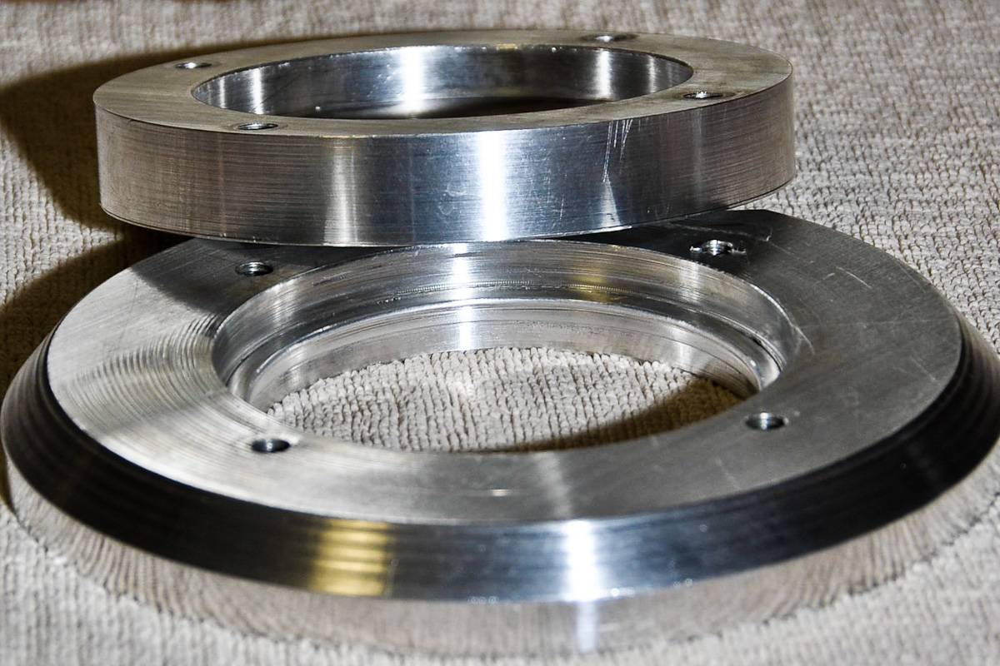
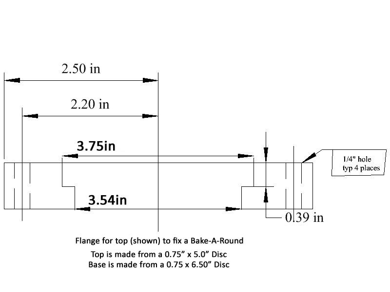
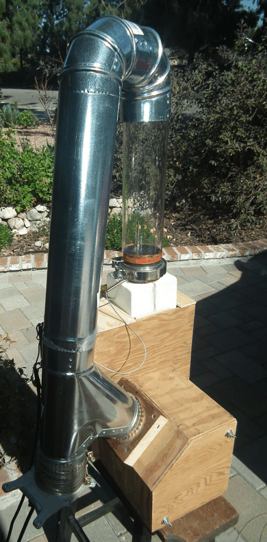
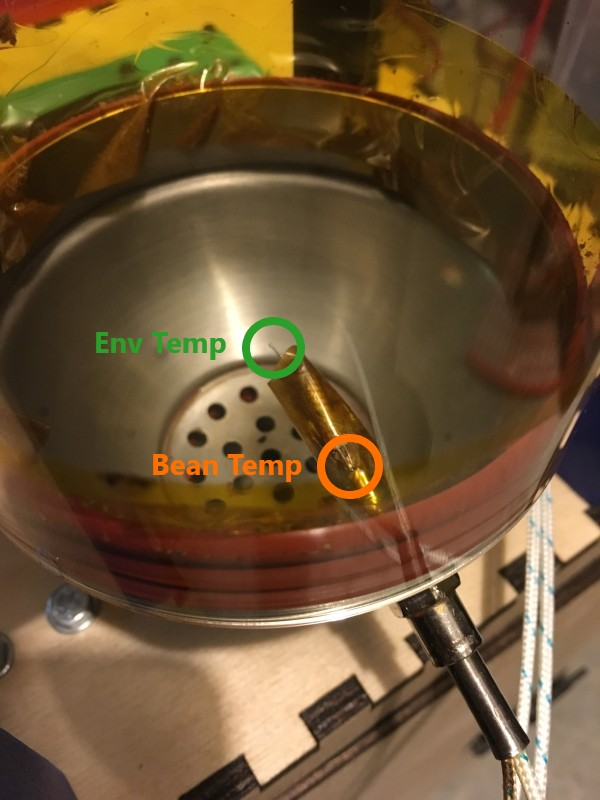
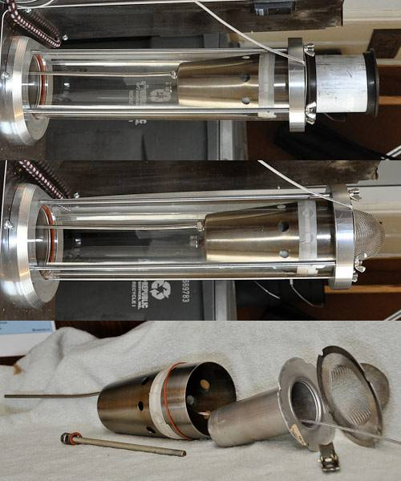
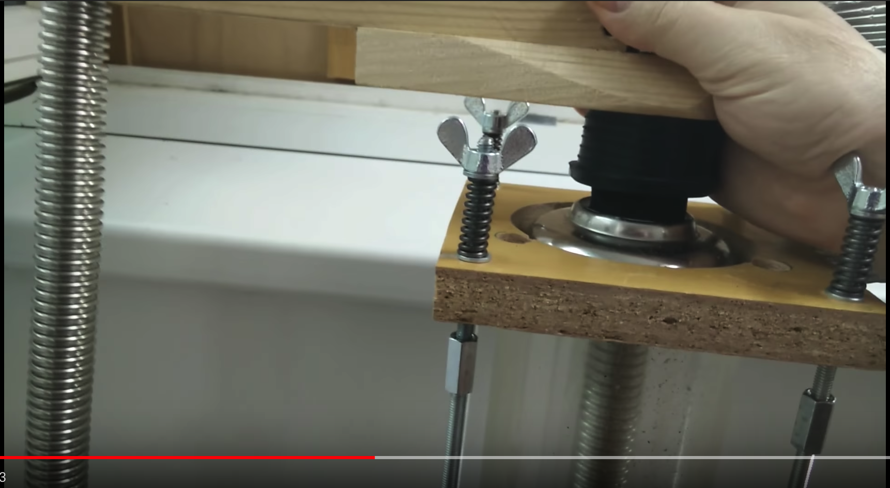
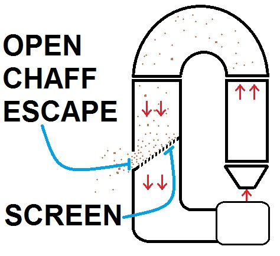

## Parts

### I have these:
 - [Bake-A-Round](http://www.pyrexlove.com/pyrex-bake-a-round/glassware/) Pyrex tube 
 - [Heat gun element](https://www.zoro.com/i/G0394895/) (Master HAS-043K, 120 V)
 
 - [Permatex 81878](https://www.zoro.com/i/G2802633/) Ultra Copper sealant
 - [vacuum motor](https://www.zoro.com/i/G0986632/)
    Ametek Lamb two-stage 2-stage blower (97 CFM, 8.3Amp, 120 V, [1000W electrical] model 116392
 - Crydom [D2425 Solid State Relay](https://www.hbcontrols.com/product-page/d2425) w/ Heat Sink
 - thermocouples with 1/4-20 thread.  Can get them from [Auberins](https://www.auberins.com/index.php?main_page=index&cPath=3)
 - [Versachem 73009 Super Clear Silicone](https://www.amazon.com/dp/B0002JN5I8/ref=cm_sw_em_r_mt_dp_U_bztwEbQMZ44DX)
 - [Permatex 81160 High-Temp Red RTV Silicone Gasket](https://www.amazon.com/dp/B0002UEN1A/ref=cm_sw_em_r_mt_dp_U_eztwEbTB3FWX0)
 - [Plug-In Horsepower Resistor (KB 9842)](https://www.amazon.com/dp/B007YA2SJ0/ref=cm_sw_em_r_mt_dp_U_hztwEbJN1BJ7B)
 - [KB Electronics auxiliary heatsink 9861](https://acim.nidec.com/drives/kbelectronics/-/media/kbelectronics/documents/dc-drives/data-sheets/9861.ashx?la=en)
    Probably not needed as I will likely not run the blower maxed out,
but I always use heatsinks

### On order:
 - [KBIC-125 DC motor controller](https://acim.nidec.com/drives/kbelectronics/-/media/kbelectronics/documents/dc-drives/data-sheets/kbic-0719.ashx?la=en)
 - [5Kohm potentiometer](https://www.amazon.com/dp/B07DHG6SYS/ref=cm_sw_em_r_mt_dp_U_0wtwEb4S71QP0)
 - Auber SYL-2352 [PID with ramp and soak](https://www.auberins.com/images/Manual/SYL-2352P%20Manual.pdf)
 - [Silicone O-rings](https://www.amazon.com/dp/B000FN0Z98/ref=cm_sw_em_r_mt_dp_U_nstwEbZ1QKNF5)
 - [Insulating Fire Brick - 9" x 4.5" x 2.5"](https://www.amazon.com/dp/B07XVSCNZV/ref=cm_sw_em_r_mt_dp_U_2ZtwEbMGV0W62) (set of four bricks, get soft ones so that you can carve out the chamber)
    

### Need to fabricate:
 - 20 ga. SS perf plate (It has nineteen .15 inch diameter holes)
 
#### Holder for pyrex

Aluminum:
 - one 5" circle 3/4" thick
 - one 6.5" circle 3/4" thick
 
Measurements:
 

## From "Brewin_Bruin's" project:
https://forum.homeroasters.org/forum/viewthread.php?thread_id=5505&pid=65069#post_65069

 - Permatex 81878 Ultra Copper sealant
 - 3.5 in stainless steel tubing (16 ga wall thickness) with a stainless V-flange
 - 4" metal ductwork

    
 
## From "OldGearHead's" project:
https://forum.homeroasters.org/forum/viewthread.php?thread_id=2207
 
## LKM looks interesting
https://github.com/elkayem/CoffeeRoaster

Here is a closeup of the thermocouple placement used by LKM, 
the TC at the center measures the environmental temp (the 
temp of the hot air) and the one toward the side of the chamber 
measures the bean temp.

## Cool looking chaff screen
https://www.youtube.com/watch?v=BZEuagSot7E

## OldGearHead's chaff collector

Exploded view,left-to-right:
 - 1 - 200mm 'K' TC
 - 2 - 5/16" nuts
 - 1 - 5/16" washer
 - 1 - 5/16" silicone 'O' ring
 - 1 - 5/16" threaded rod
 - 1 - 3.5" diameter cocktail shaker (body)
 - 1 - Angel Cake center post
 - 1 - 5/16" toggle nut
 - 1 - strainer

## Fireproof shopvac filter
[Filters](https://www.amazon.com/dp/B083W6564Q/ref=cm_sw_em_r_mt_dp_U_UTFvEbEZHSGZH)

Need to think about whether or not the air is safe to 
recirculate after going through these filters

## Advice from "dja"
First thing to design is a handle on the roast chamber, 
mine is pyrex and at 550 degrees its no fun if you forget 
your mitts

## Removing beans from roasting chamber
[Video from OldGearHead](https://www.youtube.com/watch?v=uDQoVGO9Ac4)

## Better way to remove the beans
No shopvac needed, use the pressure of the blower and 
seal off the exit with a rubber seal.  This forces the 
beans through a hose.
https://www.youtube.com/watch?v=VxOij89bTOU

## Thermocouple placement

From OldGearHead

I ran my roaster for several months with a very long 
thermocouple from the top plate into the bean mass,. 
and the temperatures were right on what the reference 
books say: 400-410°F first crack, and 420-430°F finish. 
However, I also tracked everything with a second thermocouple 
located 1.5 inches below the perf plate. What I found 
was that after T+3 minutes the tc located below the perf 
plate tracked the BMT probe with an offset of -30°F. 
Therefore, two years ago, I stopped using the BMT probe 
and never looked back.

## Chad's chaff exit

## Firebricks

### Info
https://ceramicartsnetwork.org/wp-content/uploads/2010/06/firebrick-types.pdf

fan > heater > chamber > atmosphere

motor drive

Auber PID with Ramp / Soak

## KBIC trim from OldGearHead

Okay, I'm just about 100% with this project. I have installed the DC drive, and I would like to report that it is far superior (and less costly) than the Dayton router controller. I set up the drive as follows:
Min speed = 20 VDC
Max speed - 70 VDC
HP = 1.0 (resistor)
Current limit = 6 amp

