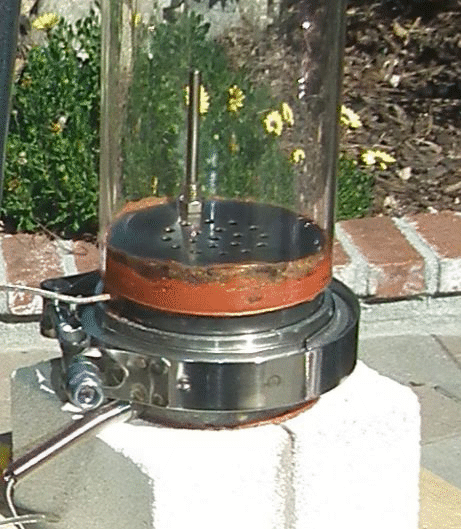
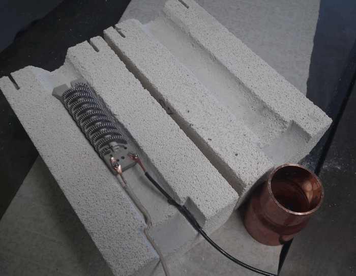
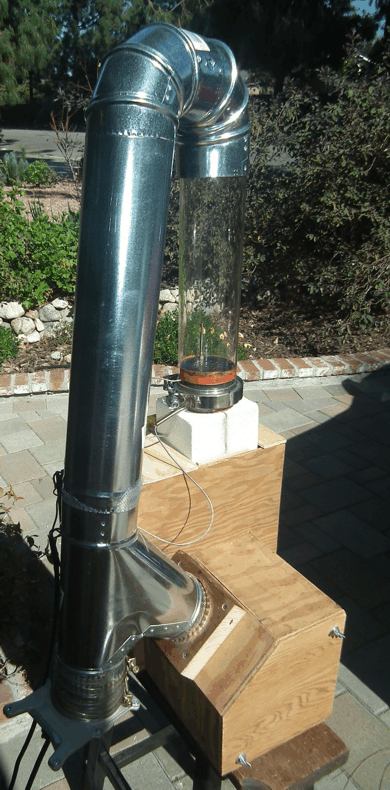
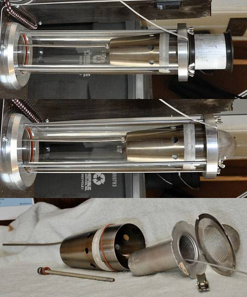

 - KBIC-225 [controller](https://www.ebay.com/itm/KBIC-SOILD-STATE-VARIABLE-SPEED-DC-MOTOR-CONTROL-KBIC-22S-30-DAY-WARRANTY/181192621391)
 - KBIC controller [HP resistor](https://www.amazon.com/gp/product/B007YA2SJ0/ref=ox_sc_act_title_1?smid=AYJQB4BLLY87P&psc=1)
 - [RTV Silicone Sealant](https://www.zoro.com/i/G2802633/)
 - [Heat gun element](https://www.zoro.com/i/G0394895/)
 - [vacuum motor](https://www.zoro.com/i/G0986632/)

## From "Brewin_Bruin's" project:
https://forum.homeroasters.org/forum/viewthread.php?thread_id=5505&pid=65069#post_65069

 - Ametek Lamb two-stage 2-stage blower (97 CFM, 8.3Amp, 120 V, [1000W electrical] model 116392)
 - DC speed controller (KBIC-125, slightly higher current model than used by OGH). The blower never runs much over half speed, the DC controller is super.
 - Bake-a-round 
 - Fire Bricks: Need to be about 2.5 inches thick so that two of them mortared together can have a 3.5" hole drilled in the top
    
 - single 1700 W heat gun element (Master HAS-043K, 120 V)
     
 - Permatex 81878 Ultra Copper sealant
 - 3.5 in stainless steel tubing (16 ga wall thickness) with a stainless V-flange
 - 20 ga. SS perf plate (It has nineteen .15 inch diameter holes)
     
 - 4" metal ductwork
 
     
 - thermocouples with 1/4-20 thread.  Can get them from [Auberins](https://www.auberins.com/index.php?main_page=index&cPath=3), I think I have a bunch 
 
## From "OldGearHead's" project:
https://forum.homeroasters.org/forum/viewthread.php?thread_id=2207
+ 1 - Bloomfield 8773 (Junk) Coffee Brewer
+ 1 - Wooden box 30’x18”x13”
+ 4 - 2.5” Castors
+ 4 feet of 2” Schedule 40 PVC pipe
+ 1 - 3 inch Schedule 40 PVC flange
+ 1 - 3 inch-to-two inch Schedule 40 PVC adapter
+ 8 feet of 2.5” flex hose
+ 1 - 2” Schedule 40 PVC ‘T’, for bean-evac-to quart jar
+ 2 - Two inch Schedule 40 PVC couplers
+ 1 - 1-1/2 HP spa blower (booted)
+ 6 - ‘T’ nuts (10-24)
+ 2 - 1” x 3” piano hinges
+ 1 lot machine screws, washers, and nuts
+ 1 - 12”x 1.5” Chrome sink drain extension
+ 1 - 3.5” Stainless steel cocktail shaker
+ 1 - Master HAS-043K heat gun element
+ 1 lot Permatex Red silicone
+ 1 lot hookup wire
+ 1 - 14/3 Power cord
+ 1 - 7.75” piece of 35 mm DIN rail
+ 10 - 8 mm DIN terminals
+ 1 - Ice cube relay & socket
+ 1- Nema 4x Enclosure 9”x 7” x 4”
+ 1 - Extech VFL PID Controller
+ 1 - Tyco 50A SSR
+ 1 - Brew switch (momentary rocker)
+ 1 - Heater stop switch (momentary N.C. push button)
+ 1 - Corning bread tube (3.75” x 14”)
+ 1 - 3” x 3” Aluminum turbo hose coupler
+ 1 - Zach & Dani chaff screen and baffle-type separator
+ 3 - Very nice RC parts, custom built by DJA
+ 1 - Lot of silicone o-rings
+ 1 - Box of Band-Aids
___ 1 - Tyco 30A circuit breaker
___ 3 - DIN Ground terminals
___ 1 - Green Pilot light
___ 1 - Main switch (maintained rocker)
___ 1 - Dayton 4X796B motor speed controller
___ 1 - Shop vac hose and wand assembly (1.25 inch) for bean-evac-to-quart jar
 
## LMK looks interesting
https://github.com/elkayem/CoffeeRoaster

## Cool looking chaff screen
https://www.youtube.com/watch?v=BZEuagSot7E

## OldGearHead's chaff collector

Exploded view,left-to-right:
 - 1 - 200mm 'K' TC
 - 2 - 5/16" nuts
 - 1 - 5/16" washer
 - 1 - 5/16" silicone 'O' ring
 - 1 - 5/16" threaded rod
 - 1 - 3.5" diameter cocktail shaker (body)
 - 1 - Angel Cake center post
 - 1 - 5/16" toggle nut
 - 1 - strainer

## Fireproof shopvac filter
[Filters](https://www.amazon.com/dp/B083W6564Q/ref=cm_sw_em_r_mt_dp_U_UTFvEbEZHSGZH)

Need to think about whether or not the air is safe to recirculate after going through these filters

## Advice from "dja"
first thing to design is a handle on the roast chamber, mines pyrex and at 550 degrees its no fun if you forget you mitts

## Removing beans from roasting chamber
[Video from OldGearHead](https://www.youtube.com/watch?v=uDQoVGO9Ac4)

## Thermocouple placement

From OldGearHead

I ran my roaster for several months with a very long thermocouple from the top plate into
the bean mass,. and the temperatures were right on what the reference books say: 400-410°F 
first crack and 420-430°F finish. However, I also tracked everything with a second thermocouple 
located 1.5 inches below the perf plate. What I found was that after T+3 minutes the tc 
located below the perf plate tracked the BMT probe with an offset of -30°F. Therefore, 
two years ago, I stopped using the BMT probe and never looked back.
